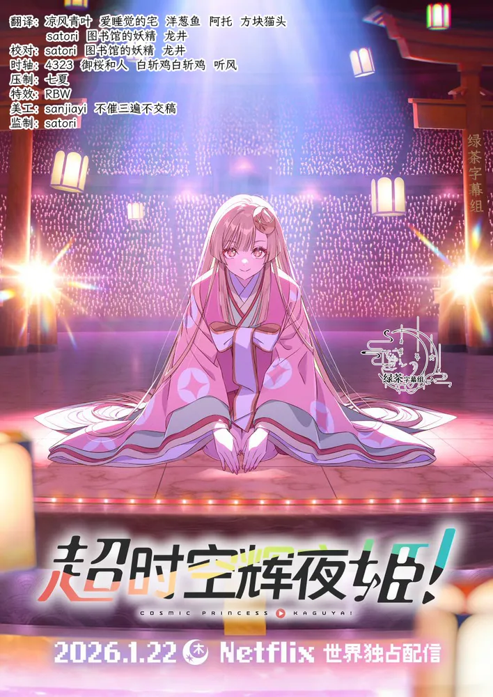

  

# Chou Kaguya-hime

《Chou Kaguya-hime》是一部将《竹取物语》重新解构为近未来音乐奇幻的长篇动画电影。
故事围绕女高中生酒寄彩叶与来自月球的少女辉夜展开，把虚拟世界、直播竞赛与青春成长交织在一起。

## 字幕说明

- `JPSC`：日文原文 + 简体中文
- `JPTC`：日文原文 + 繁體中文

## 文件列表

| 集数 / 内容 | JPSC | JPTC |
| --- | --- | --- |
| Movie | [`[Studio GreenTea] Chou Kaguya-hime [Movie].JPSC.ass`](<./[Studio GreenTea] Chou Kaguya-hime [Movie].JPSC.ass>) | [`[Studio GreenTea] Chou Kaguya-hime [Movie].JPTC.ass`](<./[Studio GreenTea] Chou Kaguya-hime [Movie].JPTC.ass>) |

## 字体下载

- [字体下载（于完结后放上链接）]()

## Staff

| 职位 | 人员 |
| --- | --- |
| 翻译 | 凉风青叶、洋葱鱼、阿托、方块猫头、satori、图书馆的妖精、龙井 |
| 校对 | satori、图书馆的妖精、龙井 |
| 时轴 | 4323、御楼和人、白斩鸡白斩鸡、听风 |
| 压制 | 七夏 |
| 特效 | RBW |
| 美工 | sanjiayi、不催三遍不交稿 |
| 监制 | satori |
