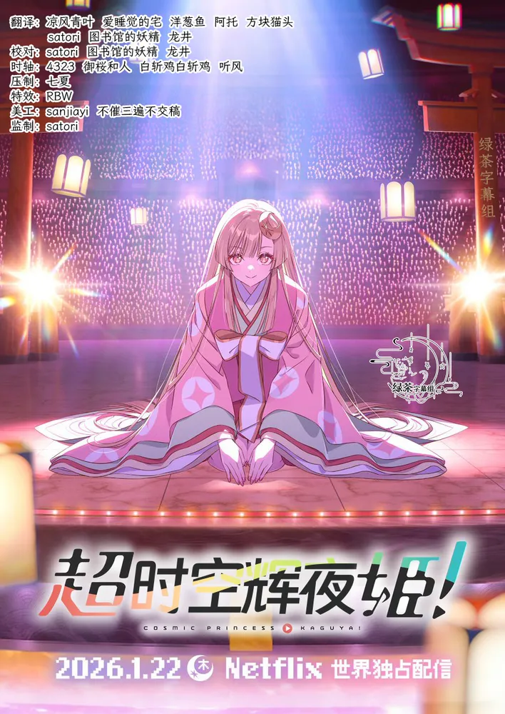

  

# 超时空辉夜姬

《超时空辉夜姬》是一部将《竹取物语》重新解构为近未来音乐奇幻的长篇动画电影。
故事围绕女高中生酒寄彩叶与来自月球的少女辉夜展开，把虚拟世界、直播竞赛与青春成长交织在一起。

## 字幕说明

- `JPSC`：日文原文 + 简体中文
- `JPTC`：日文原文 + 繁體中文

## 文件列表

| 集数 / 内容 | JPSC | JPTC |
| --- | --- | --- |
| Movie | [`[Studio GreenTea] Chou Kaguya-hime [Movie].JPSC.ass`](<./[Studio GreenTea] Chou Kaguya-hime [Movie].JPSC.ass>) | [`[Studio GreenTea] Chou Kaguya-hime [Movie].JPTC.ass`](<./[Studio GreenTea] Chou Kaguya-hime [Movie].JPTC.ass>) |

## 字体下载

- [字体包 Part 1](https://wwbuk.lanzoub.com/iIMJO3sgqrab)（提取码：8foe）
- [字体包 Part 2](https://wwbuk.lanzoub.com/iXkdh3sgqt0d)（提取码：dhmr）
- [字体包 Part 3](https://wwbuk.lanzoub.com/iYL7x3sgquyd)（提取码：d7up）
- [字体包 Part 4](https://wwbuk.lanzoub.com/ikb9h3sgqwub)（提取码：5snr）
- [字体包 Part 5](https://wwbuk.lanzoub.com/iDhRS3sgqy3g)（提取码：7bb1）

## Staff

| 职位 | 人员 |
| --- | --- |
| 翻译 | 凉风青叶、洋葱鱼、阿托、方块猫头、satori、图书馆的妖精、龙井 |
| 校对 | satori、图书馆的妖精、龙井 |
| 时轴 | 4323、御楼和人、白斩鸡白斩鸡、听风 |
| 压制 | 七夏 |
| 特效 | RBW |
| 美工 | sanjiayi、不催三遍不交稿 |
| 监制 | satori |
