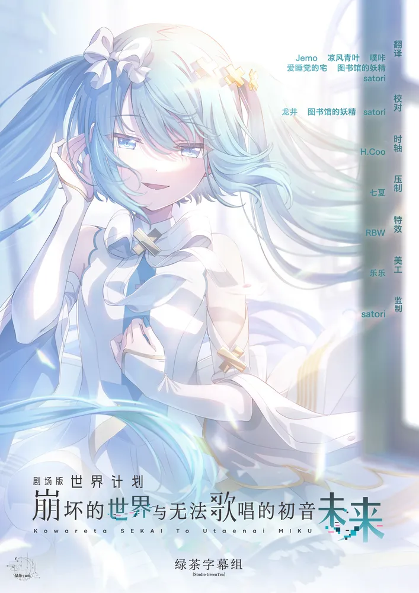

  

# 世界计划 无法歌唱的初音未来 

《世界计划 无法歌唱的初音未来》是《HATSUNE MIKU: COLORFUL STAGE!》的剧场版动画，以涩谷与由情感构成的“SEKAI”为舞台。
故事围绕一位无法把歌声传达给他人的新“初音未来”展开，并借由各组合与虚拟歌手的音乐把分散的心意重新连接起来。

## 字幕说明

- `JPSC`：日文原文 + 简体中文
- `JPTC`：日文原文 + 繁體中文

## 文件列表

| 集数 / 内容 | JPSC | JPTC |
| --- | --- | --- |
| Movie | [`[Studio GreenTea] Gekijouban Project Sekai Kowareta Sekai to Utaenai Miku [Movie].JPSC.ass`](<./[Studio GreenTea] Gekijouban Project Sekai Kowareta Sekai to Utaenai Miku [Movie].JPSC.ass>) | [`[Studio GreenTea] Gekijouban Project Sekai Kowareta Sekai to Utaenai Miku [Movie].JPTC.ass`](<./[Studio GreenTea] Gekijouban Project Sekai Kowareta Sekai to Utaenai Miku [Movie].JPTC.ass>) |

## 字体下载

- [字体下载（于完结后放上链接）]()

## Staff

| 职位 | 人员 |
| --- | --- |
| 翻译 | Jemo、凉风青叶、爱睡觉的宅、图书馆的妖精、噗咔、satori |
| 校对 | 龙井、图书馆的妖精、satori |
| 时轴 | H.Coo |
| 压制 | 七夏 |
| 特效 | RBW |
| 美工 | 乐乐 |
| 特效 | satori |
