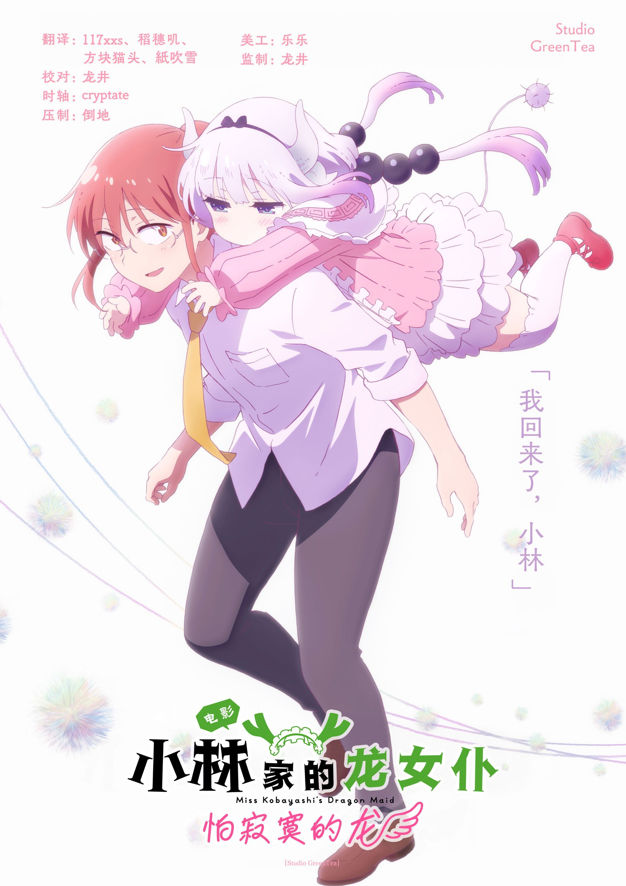

  

# 小林家的龙女仆 怕寂寞的龙

《小林家的龙女仆 怕寂寞的龙》是《小林家的龙女仆》系列首部剧场版动画，由京都动画制作。

故事紧接TV第二季结尾，程序员小林与龙族女仆托尔、幼龙康娜在人类世界过着平静的日常生活。然而，康娜的亲生父亲、混沌势力首领奇姆恩卡姆依突然到访，要求康娜返回龙族世界，归还曾因恶作剧而无意吸收的魔力。龙界"混沌"与"调和"两大阵营战火一触即发，康娜的去留关乎两界安危。小林与托尔为了守护这个已成为家庭一部分的"龙丫头"，毅然踏上前往龙族世界的旅程，展开一场交织亲情、抉择与冒险的治愈旅程。

## 字幕说明

- `JPSC`：日文原文 + 简体中文
- `JPTC`：日文原文 + 繁體中文

## 文件列表

| 集数 / 内容 | JPSC | JPTC |
| --- | --- | --- |
| Movie | [`[Studio GreenTea] Kobayashi-san Chi no Maidragon Samishigariya no Ryuu.JPSC.ass`](<./[Studio GreenTea] Kobayashi-san Chi no Maidragon Samishigariya no Ryuu.JPSC.ass>) | [`[Studio GreenTea] Kobayashi-san Chi no Maidragon Samishigariya no Ryuu.JPTC.ass`](<./[Studio GreenTea] Kobayashi-san Chi no Maidragon Samishigariya no Ryuu.JPTC.ass>) |

## 字体下载

- [字体包 Part 1](https://wwbuk.lanzoub.com/iwL9R3sgrfid)（提取码：613e）
- [字体包 Part 2](https://wwbuk.lanzoub.com/ixgdq3sgrhkh)（提取码：d5y6）

## Staff

| 职位 | 人员 |
| --- | --- |
| 翻译 | 117xxs、稻穗叽、方块猫头、紙吹雪 |
| 校对 | 龙井 |
| 时轴 | cryptate |
| 压制 | 倒地 |
| 美工 | 乐乐 |
| 监制 | 龙井 |
