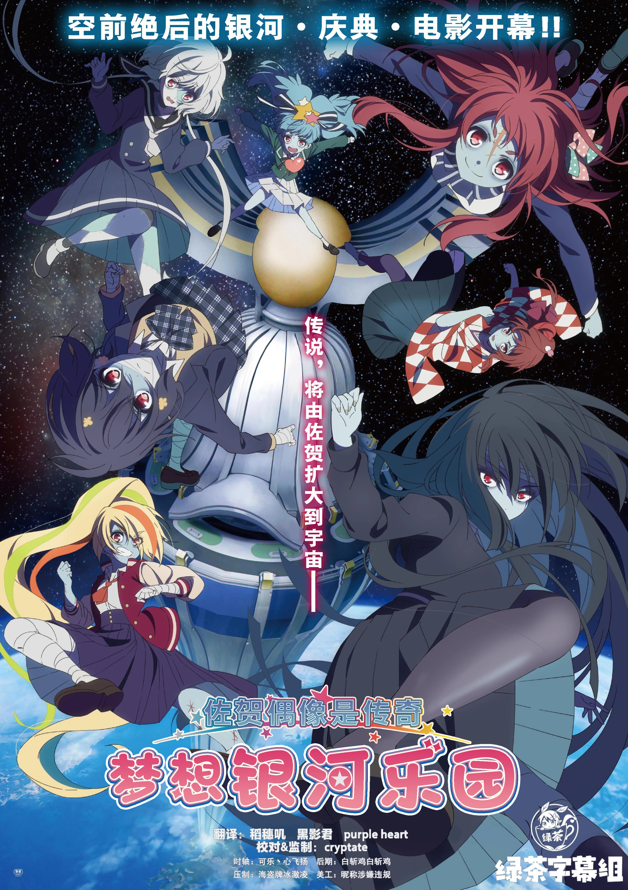

  

# 佐贺偶像是传奇 梦想银河乐园

《佐贺偶像是传奇 梦想银河乐园》是系列首部剧场版（2025年上映），承接TV第二期：以佐贺万博为舞台，七人僵尸偶像法兰秀秀遭遇空前骚动，在笑与泪中守护佐贺。

## 字幕说明

- `JPSC`：日文原文 + 简体中文
- `JPTC`：日文原文 + 繁體中文

## 文件列表

| 集数 / 内容 | JPSC | JPTC |
| --- | --- | --- |
| Movie | [`[Studio GreenTea] Zombie Land Saga Yumeginga Paradise [Movie].JPSC.ass`](<./[Studio GreenTea] Zombie Land Saga Yumeginga Paradise [Movie].JPSC.ass>) | [`[Studio GreenTea] Zombie Land Saga Yumeginga Paradise [Movie].JPTC.ass`](<./[Studio GreenTea] Zombie Land Saga Yumeginga Paradise [Movie].JPTC.ass>) |

## 字体下载

（待补充）

## Staff

| 职位 | 人员 |
| --- | --- |
| 美工 | 昵称涉嫌违规 |
| 校对 | cryptate |
| 监制 | cryptate |
| 翻译 | 稻穗叽  黑影君  purple heart |
| 时轴 | 可乐丶心飞扬 |
| 后期 | 白斩鸡白斩鸡 |
| 压制 | 海盗牌冰激凌 |
