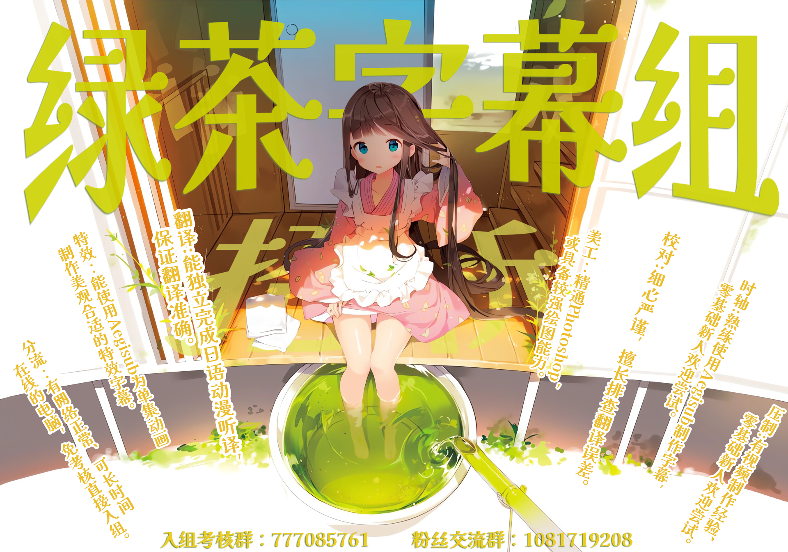

# 綠茶字幕組 字幕存儲倉庫

<center>
  
</center>

[簡體中文](README.md) / [繁體中文](README.zh-TW.md)

這裡是綠茶字幕組的字幕存儲倉庫，用來集中整理、保存和維護各作品的外掛字幕文件。

本倉庫只存放字幕，不包含視頻、封裝成品或發布包。

## 目錄結構

當前倉庫按作品類型整理，現階段為 TV 動畫字幕：

```text
TV/
  2025/
    作品目錄/
      README.md
      [Studio GreenTea] 作品名 [01][WebRip][1080p].JPSC.ass
      [Studio GreenTea] 作品名 [01][WebRip][1080p].JPTC.ass
  2026/
    作品目錄/
      README.md
      [Studio GreenTea] 作品名 [01].JPSC.ass
      [Studio GreenTea] 作品名 [01].JPTC.ass
Movie/
  作品目錄/
    README.md
    字幕文件
```

- `TV/`：TV 動畫字幕
- 每部作品單獨一個目錄
- 每個作品目錄內附一份簡短說明

## 命名規範

字幕文件名統一使用以下格式：

```text
[Studio GreenTea] 作品名 [集數][WebRip][1080p].JPSC.ass
[Studio GreenTea] 作品名 [集數][WebRip][1080p].JPTC.ass
```

例如：

```text
[Studio GreenTea] Chanto Suenai Kyuuketsuki-chan [01][WebRip][1080p].JPSC.ass
[Studio GreenTea] Chanto Suenai Kyuuketsuki-chan [01][WebRip][1080p].JPTC.ass
```

## 字幕類型

- `JPSC`：簡日雙語字幕
- `JPTC`：繁日雙語字幕

## 問題回報與貢獻

- 發現錯字、錯譯、錯軸、文件缺失或下載問題時，請提交[問題回報](https://github.com/Studio-Green-Tea/Studio-GreenTea-Subtitle-Storage/issues/new?template=problem-feedback.yml)。
- 如果已經準備好明確的修正內容，可以提交 [Pull Request](https://github.com/Studio-Green-Tea/Studio-GreenTea-Subtitle-Storage/pulls)。
- 第一次使用 GitHub 時，請按照[字幕貢獻與 PR 操作指南（簡體）](docs/字幕贡献与PR操作指南.md)逐步操作。
- 提交 Pull Request 前，請先閱讀[貢獻指南](https://github.com/Studio-Green-Tea/.github/blob/main/CONTRIBUTING.md)。

Pull Request 是向官方倉庫提出貢獻，不代表任何人獲得在倉庫之外發布字幕修改版的許可。

## 字幕轉載說明

若非特別聲明，本組字幕作品基於 [CC BY-NC-ND 4.0 協議](https://creativecommons.org/licenses/by-nc-nd/4.0/) 進行共享。

- 禁止**商用**：不得用於商業目的或參與商業性質項目。
- 禁止**修改**：不得發布任何修改版（包括但不限於內嵌、壓制、調整時間軸等）。
- 轉載規範：可自由轉載，但須**保持內容完整並註明出處**。

「禁止修改」是指未經單獨授權，不得在本倉庫之外向公眾發布字幕修改版；這不妨礙透過 Issue 或 Pull Request 向官方倉庫提出修正。提交 Pull Request 代表貢獻者同意由本組審閱、編輯、合併並發布相關貢獻，具體規則請參閱[貢獻指南](https://github.com/Studio-Green-Tea/.github/blob/main/CONTRIBUTING.md)。

### 許可範圍

本協議僅適用於本組或貢獻者有權許可的翻譯、時間軸、字幕樣式和其他原創內容。動畫原作、原始台詞、商標、字體、圖片及其他第三方材料仍歸各自權利人所有，不因存放在本倉庫中而獲得重新授權。

### 關於組間合作

如有聯合漢化、授權壓制等合作意向，請先聯繫本組獲取**單獨授權**。\
上述行為屬例外許可，不視作對原協議中「禁止演繹」條款的放棄或變更。\
聯絡郵箱：studio_greentea@163.com
