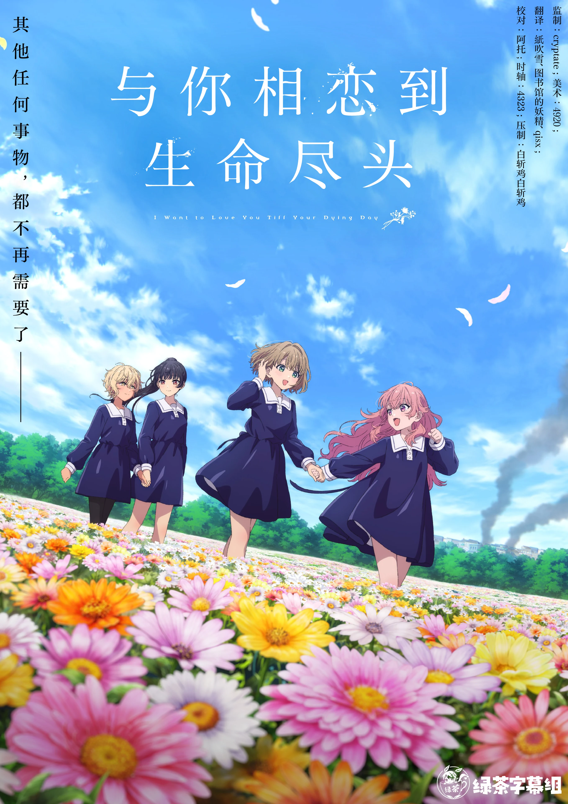

  

# 与你相恋到生命尽头

《与你相恋到生命尽头》是百合题材的黑暗奇幻动画：孤儿少女们被当作战争兵器培养，在死亡相伴的日常里，少女希娜与遍体鳞伤的米米相遇，寻找活下去的依靠。

## 字幕说明

- `JPSC`：日文原文 + 简体中文
- `JPTC`：日文原文 + 繁體中文

## 文件列表

| 集数 / 内容 | JPSC | JPTC |
| --- | --- | --- |
| 01 | [`[Studio GreenTea] Kimi ga Shinu made Koi wo Shitai [01].JPSC.ass`](<./[Studio GreenTea] Kimi ga Shinu made Koi wo Shitai [01].JPSC.ass>) | [`[Studio GreenTea] Kimi ga Shinu made Koi wo Shitai [01].JPTC.ass`](<./[Studio GreenTea] Kimi ga Shinu made Koi wo Shitai [01].JPTC.ass>) |
| 02 | [`[Studio GreenTea] Kimi ga Shinu made Koi wo Shitai [02].JPSC.ass`](<./[Studio GreenTea] Kimi ga Shinu made Koi wo Shitai [02].JPSC.ass>) | [`[Studio GreenTea] Kimi ga Shinu made Koi wo Shitai [02].JPTC.ass`](<./[Studio GreenTea] Kimi ga Shinu made Koi wo Shitai [02].JPTC.ass>) |
| 03 | [`[Studio GreenTea] Kimi ga Shinu made Koi wo Shitai [03].JPSC.ass`](<./[Studio GreenTea] Kimi ga Shinu made Koi wo Shitai [03].JPSC.ass>) | [`[Studio GreenTea] Kimi ga Shinu made Koi wo Shitai [03].JPTC.ass`](<./[Studio GreenTea] Kimi ga Shinu made Koi wo Shitai [03].JPTC.ass>) |
| 04 | [`[Studio GreenTea] Kimi ga Shinu made Koi wo Shitai [04].JPSC.ass`](<./[Studio GreenTea] Kimi ga Shinu made Koi wo Shitai [04].JPSC.ass>) | [`[Studio GreenTea] Kimi ga Shinu made Koi wo Shitai [04].JPTC.ass`](<./[Studio GreenTea] Kimi ga Shinu made Koi wo Shitai [04].JPTC.ass>) |
| 05 | [`[Studio GreenTea] Kimi ga Shinu made Koi wo Shitai [05].JPSC.ass`](<./[Studio GreenTea] Kimi ga Shinu made Koi wo Shitai [05].JPSC.ass>) | [`[Studio GreenTea] Kimi ga Shinu made Koi wo Shitai [05].JPTC.ass`](<./[Studio GreenTea] Kimi ga Shinu made Koi wo Shitai [05].JPTC.ass>) |
| 06 | [`[Studio GreenTea] Kimi ga Shinu made Koi wo Shitai [06].JPSC.ass`](<./[Studio GreenTea] Kimi ga Shinu made Koi wo Shitai [06].JPSC.ass>) | [`[Studio GreenTea] Kimi ga Shinu made Koi wo Shitai [06].JPTC.ass`](<./[Studio GreenTea] Kimi ga Shinu made Koi wo Shitai [06].JPTC.ass>) |
| 07 | [`[Studio GreenTea] Kimi ga Shinu made Koi wo Shitai [07].JPSC.ass`](<./[Studio GreenTea] Kimi ga Shinu made Koi wo Shitai [07].JPSC.ass>) | [`[Studio GreenTea] Kimi ga Shinu made Koi wo Shitai [07].JPTC.ass`](<./[Studio GreenTea] Kimi ga Shinu made Koi wo Shitai [07].JPTC.ass>) |
| 08 | [`[Studio GreenTea] Kimi ga Shinu made Koi wo Shitai [08].JPSC.ass`](<./[Studio GreenTea] Kimi ga Shinu made Koi wo Shitai [08].JPSC.ass>) | [`[Studio GreenTea] Kimi ga Shinu made Koi wo Shitai [08].JPTC.ass`](<./[Studio GreenTea] Kimi ga Shinu made Koi wo Shitai [08].JPTC.ass>) |
| 09 | [`[Studio GreenTea] Kimi ga Shinu made Koi wo Shitai [09].JPSC.ass`](<./[Studio GreenTea] Kimi ga Shinu made Koi wo Shitai [09].JPSC.ass>) | [`[Studio GreenTea] Kimi ga Shinu made Koi wo Shitai [09].JPTC.ass`](<./[Studio GreenTea] Kimi ga Shinu made Koi wo Shitai [09].JPTC.ass>) |
| 10 | [`[Studio GreenTea] Kimi ga Shinu made Koi wo Shitai [10].JPSC.ass`](<./[Studio GreenTea] Kimi ga Shinu made Koi wo Shitai [10].JPSC.ass>) | [`[Studio GreenTea] Kimi ga Shinu made Koi wo Shitai [10].JPTC.ass`](<./[Studio GreenTea] Kimi ga Shinu made Koi wo Shitai [10].JPTC.ass>) |
| 11 | [`[Studio GreenTea] Kimi ga Shinu made Koi wo Shitai [11].JPSC.ass`](<./[Studio GreenTea] Kimi ga Shinu made Koi wo Shitai [11].JPSC.ass>) | [`[Studio GreenTea] Kimi ga Shinu made Koi wo Shitai [11].JPTC.ass`](<./[Studio GreenTea] Kimi ga Shinu made Koi wo Shitai [11].JPTC.ass>) |
| 12 | [`[Studio GreenTea] Kimi ga Shinu made Koi wo Shitai [12].JPSC.ass`](<./[Studio GreenTea] Kimi ga Shinu made Koi wo Shitai [12].JPSC.ass>) | [`[Studio GreenTea] Kimi ga Shinu made Koi wo Shitai [12].JPTC.ass`](<./[Studio GreenTea] Kimi ga Shinu made Koi wo Shitai [12].JPTC.ass>) |
| 13 | [`[Studio GreenTea] Kimi ga Shinu made Koi wo Shitai [13].JPSC.ass`](<./[Studio GreenTea] Kimi ga Shinu made Koi wo Shitai [13].JPSC.ass>) | [`[Studio GreenTea] Kimi ga Shinu made Koi wo Shitai [13].JPTC.ass`](<./[Studio GreenTea] Kimi ga Shinu made Koi wo Shitai [13].JPTC.ass>) |

## 字体下载

（待补充）

## Staff

| 职位 | 人员 |
| --- | --- |
| 美工 | 4920 |
| 监制 | cryptate |
| 翻译 | 图书馆的妖精  qisx  紙吹雪 |
| 校对 | 阿托 |
| 时轴 | 4323 |
| 后期 | 白斩鸡白斩鸡 |
