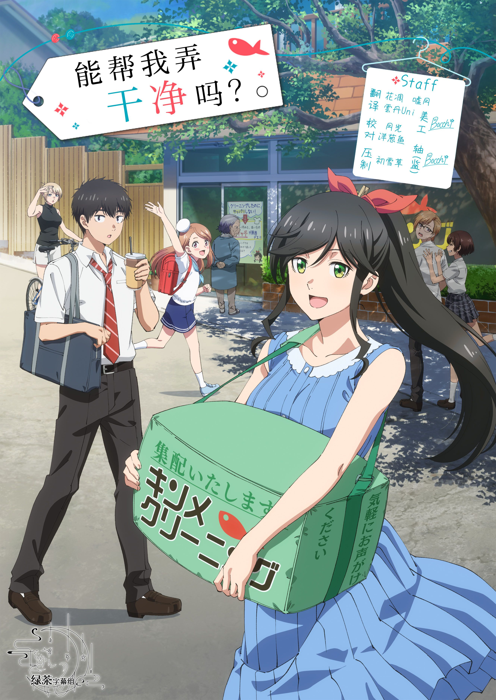

  

# 可以变得干净吗。

《能帮我弄干净吗？》是一部温馨治愈的日常系动画，改编自はっとりみつる创作的同名漫画作品。

故事以温泉胜地热海的海边小镇为舞台，讲述了经营着小小干洗店「キンメクリーニング」的金目绵花奈的日常生活。她接收的不仅仅是衣物，还有附着在衣服上的回忆、日常烦恼和人心。虽然她失去了两年前的记忆，但性格开朗、勤劳的她通过与常客和周围人的温暖交流，一点点"清理"着每个人的日常，编织出一段段沁人心脾的温馨故事。

## 字幕说明

- `JPSC`：日文原文 + 简体中文
- `JPTC`：日文原文 + 繁體中文

## 文件列表

| 集数 / 内容 | JPSC | JPTC |
| --- | --- | --- |
| 01 | [`[Studio GreenTea] Kirei ni Shite Moraemasu ka [01].JPSC.ass`](<./[Studio GreenTea] Kirei ni Shite Moraemasu ka [01].JPSC.ass>) | [`[Studio GreenTea] Kirei ni Shite Moraemasu ka [01].JPTC.ass`](<./[Studio GreenTea] Kirei ni Shite Moraemasu ka [01].JPTC.ass>) |
| 02 | [`[Studio GreenTea] Kirei ni Shite Moraemasu ka [02].JPSC.ass`](<./[Studio GreenTea] Kirei ni Shite Moraemasu ka [02].JPSC.ass>) | [`[Studio GreenTea] Kirei ni Shite Moraemasu ka [02].JPTC.ass`](<./[Studio GreenTea] Kirei ni Shite Moraemasu ka [02].JPTC.ass>) |
| 03 | [`[Studio GreenTea] Kirei ni Shite Moraemasu ka [03].JPSC.ass`](<./[Studio GreenTea] Kirei ni Shite Moraemasu ka [03].JPSC.ass>) | [`[Studio GreenTea] Kirei ni Shite Moraemasu ka [03].JPTC.ass`](<./[Studio GreenTea] Kirei ni Shite Moraemasu ka [03].JPTC.ass>) |
| 04 | [`[Studio GreenTea] Kirei ni Shite Moraemasu ka [04].JPSC.ass`](<./[Studio GreenTea] Kirei ni Shite Moraemasu ka [04].JPSC.ass>) | [`[Studio GreenTea] Kirei ni Shite Moraemasu ka [04].JPTC.ass`](<./[Studio GreenTea] Kirei ni Shite Moraemasu ka [04].JPTC.ass>) |
| 05 | [`[Studio GreenTea] Kirei ni Shite Moraemasu ka [05].JPSC.ass`](<./[Studio GreenTea] Kirei ni Shite Moraemasu ka [05].JPSC.ass>) | [`[Studio GreenTea] Kirei ni Shite Moraemasu ka [05].JPTC.ass`](<./[Studio GreenTea] Kirei ni Shite Moraemasu ka [05].JPTC.ass>) |
| 06 | [`[Studio GreenTea] Kirei ni Shite Moraemasu ka [06].JPSC.ass`](<./[Studio GreenTea] Kirei ni Shite Moraemasu ka [06].JPSC.ass>) | [`[Studio GreenTea] Kirei ni Shite Moraemasu ka [06].JPTC.ass`](<./[Studio GreenTea] Kirei ni Shite Moraemasu ka [06].JPTC.ass>) |
| 07 | [`[Studio GreenTea] Kirei ni Shite Moraemasu ka [07].JPSC.ass`](<./[Studio GreenTea] Kirei ni Shite Moraemasu ka [07].JPSC.ass>) | [`[Studio GreenTea] Kirei ni Shite Moraemasu ka [07].JPTC.ass`](<./[Studio GreenTea] Kirei ni Shite Moraemasu ka [07].JPTC.ass>) |
| 08 | [`[Studio GreenTea] Kirei ni Shite Moraemasu ka [08].JPSC.ass`](<./[Studio GreenTea] Kirei ni Shite Moraemasu ka [08].JPSC.ass>) | [`[Studio GreenTea] Kirei ni Shite Moraemasu ka [08].JPTC.ass`](<./[Studio GreenTea] Kirei ni Shite Moraemasu ka [08].JPTC.ass>) |
| 09 | [`[Studio GreenTea] Kirei ni Shite Moraemasu ka [09].JPSC.ass`](<./[Studio GreenTea] Kirei ni Shite Moraemasu ka [09].JPSC.ass>) | [`[Studio GreenTea] Kirei ni Shite Moraemasu ka [09].JPTC.ass`](<./[Studio GreenTea] Kirei ni Shite Moraemasu ka [09].JPTC.ass>) |
| 10 | [`[Studio GreenTea] Kirei ni Shite Moraemasu ka [10].JPSC.ass`](<./[Studio GreenTea] Kirei ni Shite Moraemasu ka [10].JPSC.ass>) | [`[Studio GreenTea] Kirei ni Shite Moraemasu ka [10].JPTC.ass`](<./[Studio GreenTea] Kirei ni Shite Moraemasu ka [10].JPTC.ass>) |
| 11 | [`[Studio GreenTea] Kirei ni Shite Moraemasu ka [11].JPSC.ass`](<./[Studio GreenTea] Kirei ni Shite Moraemasu ka [11].JPSC.ass>) | [`[Studio GreenTea] Kirei ni Shite Moraemasu ka [11].JPTC.ass`](<./[Studio GreenTea] Kirei ni Shite Moraemasu ka [11].JPTC.ass>) |
| 12 | [`[Studio GreenTea] Kirei ni Shite Moraemasu ka [12].JPSC.ass`](<./[Studio GreenTea] Kirei ni Shite Moraemasu ka [12].JPSC.ass>) | [`[Studio GreenTea] Kirei ni Shite Moraemasu ka [12].JPTC.ass`](<./[Studio GreenTea] Kirei ni Shite Moraemasu ka [12].JPTC.ass>) |

## 字体下载

- [字体包 Part 1](https://wwbuk.lanzoub.com/i1mZt3sgrcna)（提取码：aths）
- [字体包 Part 2](https://wwbuk.lanzoub.com/iu3Ru3sgrdpi)（提取码：gyzm）

## Staff

| 职位 | 人员 |
| --- | --- |
| 翻译 | 花调、噓月、雲丹Uni |
| 校对 | 月光、洋葱鱼 |
| 时轴 | Bochhi |
| 压制 | 初雪草 |
| 美工 | Bochhi |
| 监制 | Bochhi |
