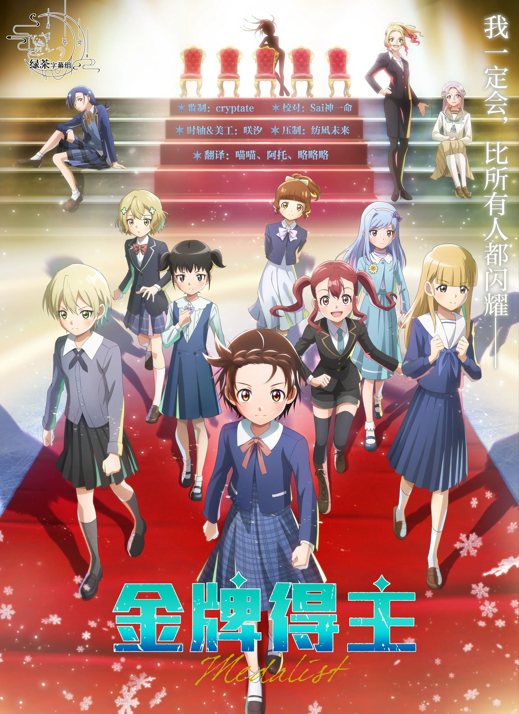

  

# 金牌得主 S2

《金牌得主 S2》是改编自つるまいかだ创作的同名漫画的花样滑冰运动动画，由 ENGI 制作。

故事讲述未能实现选手梦想的青年明浦路司，与渴望站上冰场的少女结束祈相遇，并成为她的教练。第二季中，结束祈升入新手A组，迎来了争夺全日本锦标赛出场资格的中部街区大赛。面对自幼在名门俱乐部接受训练的精英选手们，结束祈与司将携手迎战强敌，向冰上的最高荣耀发起冲击。

## 字幕说明

- `JPSC`：日文原文 + 简体中文
- `JPTC`：日文原文 + 繁體中文

## 文件列表

| 集数 / 内容 | JPSC | JPTC |
| --- | --- | --- |
| 14 | [`[Studio GreenTea] Medalist [14].JPSC.ass`](<./[Studio GreenTea] Medalist [14][WebRip][HEVC-10bit 1080p AAC ASSx2].JPSC.ass>) | [`[Studio GreenTea] Medalist [14].JPTC.ass`](<./[Studio GreenTea] Medalist [14][WebRip][HEVC-10bit 1080p AAC ASSx2].JPTC.ass>) |
| 15 | [`[Studio GreenTea] Medalist [15].JPSC.ass`](<./[Studio GreenTea] Medalist [15][WebRip][HEVC-10bit 1080p AAC ASSx2].JPSC.ass>) | [`[Studio GreenTea] Medalist [15].JPTC.ass`](<./[Studio GreenTea] Medalist [15][WebRip][HEVC-10bit 1080p AAC ASSx2].JPTC.ass>) |
| 16 | [`[Studio GreenTea] Medalist [16].JPSC.ass`](<./[Studio GreenTea] Medalist [16][WebRip][HEVC-10bit 1080p AAC ASSx2].JPSC.ass>) | [`[Studio GreenTea] Medalist [16].JPTC.ass`](<./[Studio GreenTea] Medalist [16][WebRip][HEVC-10bit 1080p AAC ASSx2].JPTC.ass>) |
| 17 | [`[Studio GreenTea] Medalist [17].JPSC.ass`](<./[Studio GreenTea] Medalist [17][WebRip][HEVC-10bit 1080p AAC ASSx2].JPSC.ass>) | [`[Studio GreenTea] Medalist [17].JPTC.ass`](<./[Studio GreenTea] Medalist [17][WebRip][HEVC-10bit 1080p AAC ASSx2].JPTC.ass>) |
| 18 | [`[Studio GreenTea] Medalist [18].JPSC.ass`](<./[Studio GreenTea] Medalist [18][WebRip][HEVC-10bit 1080p AAC ASSx2].JPSC.ass>) | [`[Studio GreenTea] Medalist [18].JPTC.ass`](<./[Studio GreenTea] Medalist [18][WebRip][HEVC-10bit 1080p AAC ASSx2].JPTC.ass>) |
| 19 | [`[Studio GreenTea] Medalist [19].JPSC.ass`](<./[Studio GreenTea] Medalist [19][WebRip][HEVC-10bit 1080p AAC ASSx2].JPSC.ass>) | [`[Studio GreenTea] Medalist [19].JPTC.ass`](<./[Studio GreenTea] Medalist [19][WebRip][HEVC-10bit 1080p AAC ASSx2].JPTC.ass>) |
| 20 | [`[Studio GreenTea] Medalist [20].JPSC.ass`](<./[Studio GreenTea] Medalist [20][WebRip][HEVC-10bit 1080p AAC ASSx2].JPSC.ass>) | [`[Studio GreenTea] Medalist [20].JPTC.ass`](<./[Studio GreenTea] Medalist [20][WebRip][HEVC-10bit 1080p AAC ASSx2].JPTC.ass>) |
| 21 | [`[Studio GreenTea] Medalist [21].JPSC.ass`](<./[Studio GreenTea] Medalist [21][WebRip][HEVC-10bit 1080p AAC ASSx2].JPSC.ass>) | [`[Studio GreenTea] Medalist [21].JPTC.ass`](<./[Studio GreenTea] Medalist [21][WebRip][HEVC-10bit 1080p AAC ASSx2].JPTC.ass>) |
| 22 | [`[Studio GreenTea] Medalist [22].JPSC.ass`](<./[Studio GreenTea] Medalist [22][WebRip][HEVC-10bit 1080p AAC ASSx2].JPSC.ass>) | [`[Studio GreenTea] Medalist [22].JPTC.ass`](<./[Studio GreenTea] Medalist [22][WebRip][HEVC-10bit 1080p AAC ASSx2].JPTC.ass>) |

## 字体下载

- [字体包 Part 1](https://wwbuk.lanzoub.com/iSnPm4831rwb)（提取码：9zj9）
- [字体包 Part 2](https://wwbuk.lanzoub.com/i8c8k4831tyf)（提取码：96iu）

## Staff

| 职位 | 人员 |
| --- | --- |
| 翻译 | 喵喵、阿托、略略略 |
| 校对 | Sai神一命 |
| 时轴 | 咲汐 |
| 压制 | 纺凪未来  |
| 美工 | 咲汐 |
| 监制 | cryptate |
