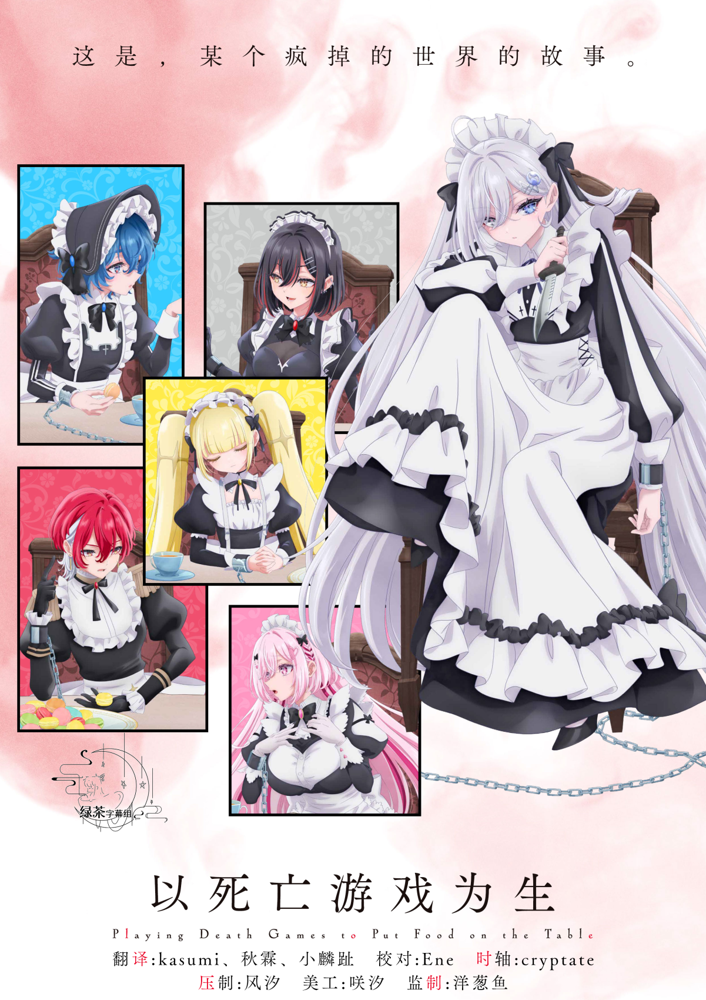

  

# 以死亡游戏为生

《以死亡游戏为生》是一部融合死亡游戏与美食元素的悬疑动画，讲述了17岁的职业死亡游戏玩家反町友树在致命挑战中求生的故事。

作品以独特的视角展现了主角在各种生死攸关的游戏中，不仅要运用智慧和策略活下去，还要在极端环境下享受美食的奇妙日常。

## 字幕说明

- `JPSC`：日文原文 + 简体中文
- `JPTC`：日文原文 + 繁體中文

## 文件列表

| 集数 / 内容 | JPSC | JPTC |
| --- | --- | --- |
| 01 | [`[Studio GreenTea] Shibou Yuugi de Meshi wo Kuu [01].JPSC.ass`](<./[Studio GreenTea] Shibou Yuugi de Meshi wo Kuu [01].JPSC.ass>) | [`[Studio GreenTea] Shibou Yuugi de Meshi wo Kuu [01].JPTC.ass`](<./[Studio GreenTea] Shibou Yuugi de Meshi wo Kuu [01].JPTC.ass>) |
| 02 | [`[Studio GreenTea] Shibou Yuugi de Meshi wo Kuu [02].JPSC.ass`](<./[Studio GreenTea] Shibou Yuugi de Meshi wo Kuu [02].JPSC.ass>) | [`[Studio GreenTea] Shibou Yuugi de Meshi wo Kuu [02].JPTC.ass`](<./[Studio GreenTea] Shibou Yuugi de Meshi wo Kuu [02].JPTC.ass>) |
| 03 | [`[Studio GreenTea] Shibou Yuugi de Meshi wo Kuu [03].JPSC.ass`](<./[Studio GreenTea] Shibou Yuugi de Meshi wo Kuu [03].JPSC.ass>) | [`[Studio GreenTea] Shibou Yuugi de Meshi wo Kuu [03].JPTC.ass`](<./[Studio GreenTea] Shibou Yuugi de Meshi wo Kuu [03].JPTC.ass>) |
| 04 | [`[Studio GreenTea] Shibou Yuugi de Meshi wo Kuu [04].JPSC.ass`](<./[Studio GreenTea] Shibou Yuugi de Meshi wo Kuu [04].JPSC.ass>) | [`[Studio GreenTea] Shibou Yuugi de Meshi wo Kuu [04].JPTC.ass`](<./[Studio GreenTea] Shibou Yuugi de Meshi wo Kuu [04].JPTC.ass>) |
| 05 | [`[Studio GreenTea] Shibou Yuugi de Meshi wo Kuu [05].JPSC.ass`](<./[Studio GreenTea] Shibou Yuugi de Meshi wo Kuu [05].JPSC.ass>) | [`[Studio GreenTea] Shibou Yuugi de Meshi wo Kuu [05].JPTC.ass`](<./[Studio GreenTea] Shibou Yuugi de Meshi wo Kuu [05].JPTC.ass>) |
| 06 | [`[Studio GreenTea] Shibou Yuugi de Meshi wo Kuu [06].JPSC.ass`](<./[Studio GreenTea] Shibou Yuugi de Meshi wo Kuu [06].JPSC.ass>) | [`[Studio GreenTea] Shibou Yuugi de Meshi wo Kuu [06].JPTC.ass`](<./[Studio GreenTea] Shibou Yuugi de Meshi wo Kuu [06].JPTC.ass>) |
| 07 | [`[Studio GreenTea] Shibou Yuugi de Meshi wo Kuu [07].JPSC.ass`](<./[Studio GreenTea] Shibou Yuugi de Meshi wo Kuu [07].JPSC.ass>) | [`[Studio GreenTea] Shibou Yuugi de Meshi wo Kuu [07].JPTC.ass`](<./[Studio GreenTea] Shibou Yuugi de Meshi wo Kuu [07].JPTC.ass>) |
| 08 | [`[Studio GreenTea] Shibou Yuugi de Meshi wo Kuu [08].JPSC.ass`](<./[Studio GreenTea] Shibou Yuugi de Meshi wo Kuu [08].JPSC.ass>) | [`[Studio GreenTea] Shibou Yuugi de Meshi wo Kuu [08].JPTC.ass`](<./[Studio GreenTea] Shibou Yuugi de Meshi wo Kuu [08].JPTC.ass>) |
| 09 | [`[Studio GreenTea] Shibou Yuugi de Meshi wo Kuu [09].JPSC.ass`](<./[Studio GreenTea] Shibou Yuugi de Meshi wo Kuu [09].JPSC.ass>) | [`[Studio GreenTea] Shibou Yuugi de Meshi wo Kuu [09].JPTC.ass`](<./[Studio GreenTea] Shibou Yuugi de Meshi wo Kuu [09].JPTC.ass>) |
| 10 | [`[Studio GreenTea] Shibou Yuugi de Meshi wo Kuu [10].JPSC.ass`](<./[Studio GreenTea] Shibou Yuugi de Meshi wo Kuu [10].JPSC.ass>) | [`[Studio GreenTea] Shibou Yuugi de Meshi wo Kuu [10].JPTC.ass`](<./[Studio GreenTea] Shibou Yuugi de Meshi wo Kuu [10].JPTC.ass>) |
| 11 | [`[Studio GreenTea] Shibou Yuugi de Meshi wo Kuu [11].JPSC.ass`](<./[Studio GreenTea] Shibou Yuugi de Meshi wo Kuu [11].JPSC.ass>) | [`[Studio GreenTea] Shibou Yuugi de Meshi wo Kuu [11].JPTC.ass`](<./[Studio GreenTea] Shibou Yuugi de Meshi wo Kuu [11].JPTC.ass>) |

## 字体下载

- [字体包](https://wwbuk.lanzoub.com/iYiCm3sgrwda)（提取码：7ojo）

## Staff

| 职位 | 人员 |
| --- | --- |
| 翻译 | kasumi、秋霖、小麟趾 |
| 校对 | Ene |
| 时轴 | cryptate |
| 压制 | 风汐 |
| 美工 | 咲汐 |
| 监制 | 洋葱鱼 |
